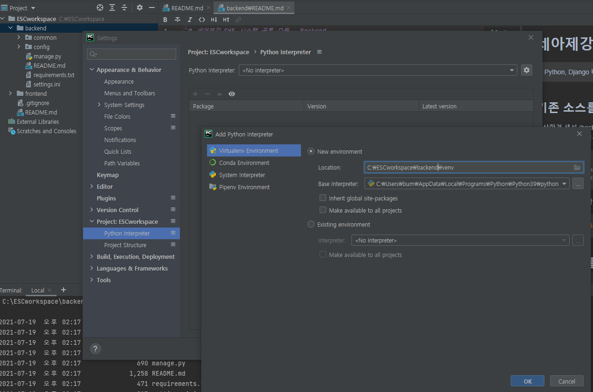
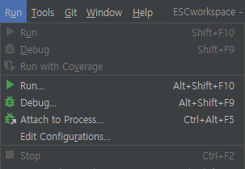
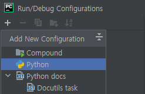

# edu_mgnt_1 API 서비스
[](https://www.python.org/downloads/release/python-396/)
[]()
[]()

* Python, Django(DRF)
> Python, Django 버전 및 종속 패키지의 버전은 [requiremnts](./src/requiremnts/) 폴더에 `requiremnts_ooo.txt` 파일을 참고하세요.

## 기존 소스를 받을 경우

가상환경 생성 (src 폴더에서 실행)  
- [CLI 이용] python 가상환경 이름 -> `venv`
- [IDE 이용 venv셋팅](#IDE-이용-venv셋팅)

```bash
$ cd src
src $ python3 -m venv venv
src $ source ./venv/bin/activate
```

package 복원 (가상환경에서 실행)

```bash
(venv) src $ pip install -r requirements.txt
```

## 새로운 모듈을 설치한 경우

package 목록 저장 (가상환경에서 실행)

```bash
(venv) src $ pip freeze > requirements.txt
```

## settings.ini 정보 확인

[app_settings](./src/app_settings/) 폴더에 `settings_ooo.ini` 파일의 내용을 확인하고, 필요시 수정합니다.

```
[settings]
SECRET_KEY=django-secret_key
DB_NAME=db_name
DB_USER=db_user_name
DB_PASSWORD=db_user_password
DB_HOST=db_ip_address
DB_PORT=db_port
```

## Swagger UI

가상환경(venv)에서 어플리케이션 실행 / [IDE 이용 Server run](#IDE-이용-Server-run)

```bash
(venv) src $ python3 manage.py runserver
```

다음 url에 접속하여 swagger ui를 확인한다.

> http://127.0.0.1:8000/swagger

# 기타 참고
## IDE 이용 venv셋팅
메뉴 File/Settings
Python Interpreter 설정 -> Location변경 (venv 생성위치)


## IDE 이용 Server run
메뉴 Run/Edit Configurations<br>
<br>
+Add New Config/Python<br>
<br>
Script Path에 backend/manage.py 지정, Parameters에 runserver 입력<br>

저장 후 실행 (우측 상단에 실행/정지 아이콘 사용)